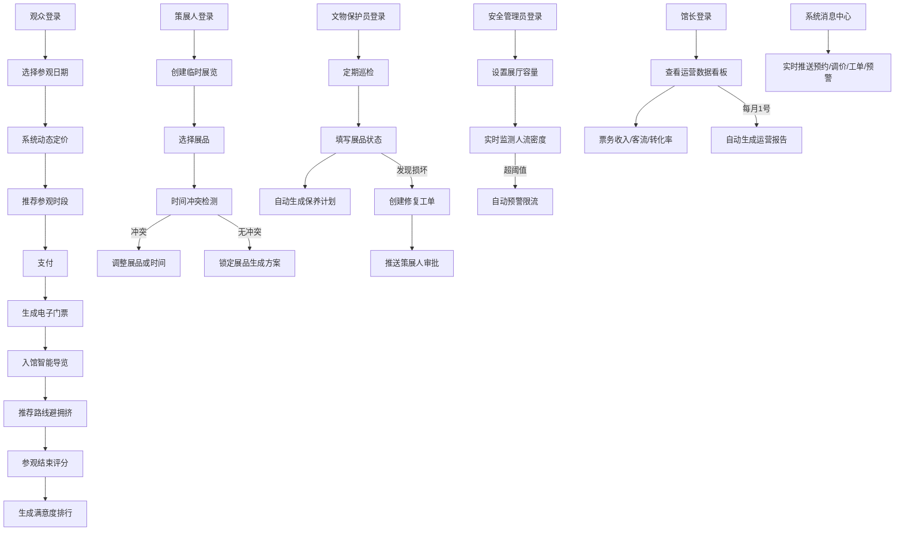

## 1. 产品概述
大型博物馆智慧管理与观众体验平台，通过数字化技术实现博物馆运营全流程智能化管理，提升观众参观体验与博物馆运营效率。
- 服务于观众、策展人、文物保护员、安全管理员、馆长五种角色，覆盖票务预约、展览策划、文物保护、安全管理、运营决策全场景
- 核心价值：智能动态定价提升收益、个性化参观体验增强满意度、文物预防性保护、实时安全防控、数据驱动运营决策

## 2. 核心功能

### 2.1 用户角色
| 角色 | 注册方式 | 核心权限 |
|------|----------|----------|
| 观众 | 手机号/微信注册 | 门票预约支付、电子门票、智能参观路线、评分反馈 |
| 策展人 | 管理员分配账号 | 创建临时展览、展品冲突检测、修复工单审批 |
| 文物保护员 | 管理员分配账号 | 展品巡检、状态记录、保养计划查看、修复工单提交 |
| 安全管理员 | 管理员分配账号 | 展厅容量设置、人流密度监测、限流预警 |
| 馆长 | 管理员分配账号 | 全局数据看板、运营报告、收入客流分析、展览转化率 |

### 2.2 功能模块
1. **登录页**：角色选择、身份认证
2. **观众端首页**：展品推荐、门票预约入口、当前展览
3. **门票预约页**：日期时段选择、动态定价展示、偏好设置、支付
4. **电子门票页**：二维码展示、参观信息
5. **智能导览页**：个性化参观路线、实时拥挤度、展品详情
6. **评分反馈页**：展区评分、词云展示、满意度排行
7. **策展人工作台**：展览列表、创建展览、冲突检测
8. **展览方案页**：展品选择、时间排期、方案预览
9. **文物保护员工作台**：巡检任务、展品状态、保养计划
10. **修复工单页**：工单列表、新建工单、审批状态
11. **安全管理员工作台**：人流热力图、容量设置、预警列表
12. **馆长数据看板**：票务收入、客流对比、展览转化、满意度趋势
13. **消息中心**：实时消息推送、消息分类、消息详情

### 2.3 页面详情
| 页面名称 | 模块名称 | 功能描述 |
|----------|----------|----------|
| 登录页 | 角色选择器 | 五种角色切换，不同角色登录后跳转对应工作台 |
| 登录页 | 身份认证 | 账号密码登录，模拟JWT鉴权 |
| 观众端首页 | 展品推荐轮播 | 热门展品、今日推荐、即将结束展览展示 |
| 观众端首页 | 门票快捷预约 | 日期选择、快速跳转预约页 |
| 门票预约页 | 日历时段选择 | 可选择参观日期，展示各时段剩余名额 |
| 门票预约页 | 动态定价面板 | 根据历史客流、展品热度、特殊展览日期实时计算价格，显示原价/折扣价 |
| 门票预约页 | 观众偏好设置 | 兴趣标签（青铜器/书画/陶瓷等）、参观时长、是否避开拥挤 |
| 门票预约页 | 支付与电子票 | 模拟支付流程，生成带二维码的电子门票 |
| 智能导览页 | 路线地图 | 博物馆平面图，高亮推荐路线，标记拥挤区域 |
| 智能导览页 | 展品详情卡 | 点击展品查看介绍、历史、相关推荐 |
| 智能导览页 | 实时拥挤度 | 各展区人流密度热力展示，红色预警区域建议绕行 |
| 评分反馈页 | 展区评分 | 1-5星评分，文字评论 |
| 评分反馈页 | 满意度排行 | 各展区满意度排名柱状图 |
| 评分反馈页 | 评论词云 | 关键词词云可视化展示 |
| 策展人工作台 | 展览列表 | 当前展览、历史展览、待审批展览 |
| 策展人工作台 | 创建展览向导 | 基本信息→展品选择→冲突检测→方案生成 |
| 策展人工作台 | 修复工单审批 | 待审批工单列表，查看详情，通过/驳回 |
| 文物保护员工作台 | 巡检任务列表 | 今日待巡检展品，已完成/待完成状态 |
| 文物保护员工作台 | 展品状态录入 | 品相、温度、湿度、照片上传 |
| 文物保护员工作台 | 保养计划日历 | 按展品种类和保存时长自动生成的保养排期 |
| 文物保护员工作台 | 修复工单提交 | 损坏描述、紧急程度、照片附件 |
| 安全管理员工作台 | 人流热力图 | 各展厅实时人流密度颜色编码展示 |
| 安全管理员工作台 | 容量设置 | 各展厅最大容纳人数配置 |
| 安全管理员工作台 | 预警与限流 | 超阈值预警列表，一键限流建议 |
| 馆长数据看板 | 票务收入卡片 | 今日/本周/本月收入，同比环比 |
| 馆长数据看板 | 客流对比图 | 今日vs昨日、本周vs上周客流趋势折线图 |
| 馆长数据看板 | 展览转化率 | 各展览预约/实际参观/评分转化漏斗 |
| 馆长数据看板 | 月度报告入口 | 自动生成的运营报告PDF预览与下载 |
| 消息中心 | 实时消息列表 | 预约成功、调价提醒、修复工单、预警通知等分类展示 |
| 消息中心 | 消息详情 | 点击跳转对应业务页面查看详情 |

## 3. 核心流程

### 3.1 观众参观流程
观众选择参观日期→系统动态定价推荐时段→设置偏好完成支付→生成电子门票→入馆后推荐最优路线→实时避开拥挤区域→参观结束评分反馈→系统生成满意度排行和词云

### 3.2 策展人办展流程
创建临时展览→选择拟展出展品→系统自动检测其他展览时间冲突→无冲突则锁定展品→生成展览方案→上线展示

### 3.3 文物保护流程
定期巡检填写展品状态→系统根据种类和时长自动生成保养计划→发现损坏→创建修复工单→推送策展人审批→审批后执行修复

### 3.4 安全管理流程
设置各展厅最大容纳人数→系统实时监测人流密度→超阈值自动预警→建议限流措施→安全管理员执行限流

### 3.5 运营决策流程
馆长查看每日票务收入/客流对比/展览转化率→每月1号系统自动生成运营报告→推送到馆长工作台

## 4. 用户界面设计

### 4.1 设计风格
- 主色调：深褐色(#3E2723) + 金色(#B8860B) + 米白(#F5F0E6)，体现博物馆典雅厚重气质
- 辅助色：翡翠绿(#2E7D32)安全状态、朱砂红(#C62828)预警状态
- 按钮风格：圆角8px，主按钮金色渐变带微阴影，hover时有上浮效果
- 字体：标题使用"Noto Serif SC"衬线体体现文化感，正文使用"Noto Sans SC"无衬线体保证可读性
- 布局风格：侧边栏导航 + 卡片式内容区，页面留白充足
- 图标风格：Lucide图标线性风格，统一24px尺寸，金色图标用于功能入口

### 4.2 页面设计概述
| 页面名称 | 模块名称 | UI元素 |
|----------|----------|----------|
| 登录页 | 角色选择器 | 五大角色卡片，选中态金色边框发光，点击切换 |
| 登录页 | 登录表单 | 米白色卡片，深褐色文字，金色提交按钮 |
| 观众端首页 | 展品轮播 | 大图轮播带渐变遮罩，展品名称Overlay |
| 门票预约页 | 动态定价卡片 | 金色价格标签，对比划线原价，倒计时动效 |
| 智能导览页 | 路线地图 | SVG博物馆平面图，金色推荐路线，红色拥挤标记 |
| 智能导览页 | 拥挤度指示 | 颜色编码进度条，绿-黄-红渐变 |
| 评分反馈页 | 词云展示 | 关键词大小按频次映射，金色/深褐配色 |
| 策展人工作台 | 冲突检测面板 | 时间轴视图，冲突展品红色高亮标记 |
| 文物保护员工作台 | 保养日历 | 月视图，保养任务金色圆点标记 |
| 安全管理员工作台 | 人流热力图 | 各展厅色块颜色深浅表示密度，红色闪烁预警 |
| 馆长数据看板 | 数据卡片 | 大数字+趋势箭头，金色渐变背景卡片 |
| 消息中心 | 消息列表 | 左侧分类图标，右侧摘要，未读金色圆点标记 |

### 4.3 响应式
- Desktop-first设计，主内容区最小宽度1200px
- 侧边栏在1024px以下折叠为汉堡菜单
- 数据看板图表支持响应式缩放
- 表格在移动端转为卡片列表展示

### 4.4 交互动效
- 页面加载：侧边栏滑入 + 内容卡片渐入（stagger 80ms）
- 按钮点击：缩放0.95→1的微动效
- 预警闪烁：红色边框3s脉冲动画
- 价格变化：数字滚动动效
- 消息到达：右上角Toast滑入+音效提示
