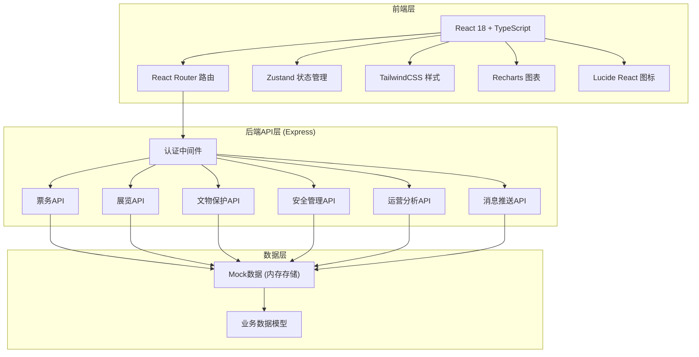
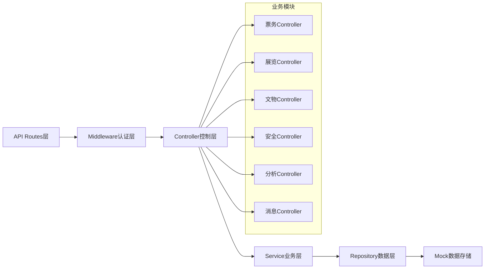
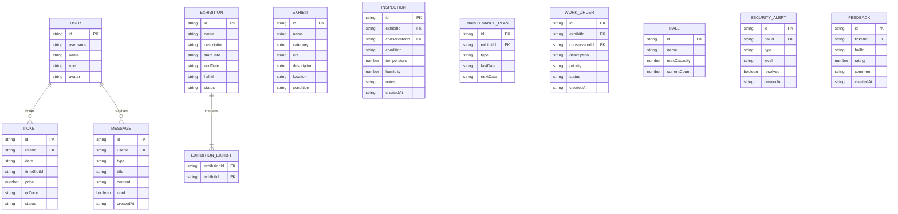

## 1. 架构设计



## 2. 技术描述
- 前端：React@18 + TypeScript + TailwindCSS@3 + Vite
- 初始化工具：vite-init
- 后端：Express@4 + TypeScript (ESM)
- 数据库：内存Mock数据（无需真实数据库，使用Mock数据模拟）
- 状态管理：Zustand
- 路由：React Router DOM
- 图表：Recharts
- 图标：Lucide React
- 二维码：qrcode.react

## 3. 路由定义
| 路由 | 角色 | 用途 |
|------|------|------|
| /login | 所有 | 登录页，角色选择 |
| /visitor/home | 观众 | 观众端首页 |
| /visitor/booking | 观众 | 门票预约 |
| /visitor/ticket | 观众 | 电子门票 |
| /visitor/guide | 观众 | 智能导览 |
| /visitor/feedback | 观众 | 评分反馈 |
| /curator/home | 策展人 | 策展人工作台 |
| /curator/exhibitions | 策展人 | 展览管理 |
| /curator/exhibitions/create | 策展人 | 创建展览 |
| /curator/workorders | 策展人 | 修复工单审批 |
| /conservator/home | 文物保护员 | 文物保护员工作台 |
| /conservator/inspections | 文物保护员 | 巡检任务 |
| /conservator/maintenance | 文物保护员 | 保养计划 |
| /conservator/workorders | 文物保护员 | 修复工单 |
| /security/home | 安全管理员 | 安全管理工作台 |
| /security/capacity | 安全管理员 | 容量设置 |
| /security/alerts | 安全管理员 | 预警限流 |
| /director/home | 馆长 | 馆长数据看板 |
| /director/reports | 馆长 | 运营报告 |
| /messages | 所有 | 消息中心 |

## 4. API 定义

### 4.1 认证
```typescript
// POST /api/auth/login
interface LoginRequest {
  username: string;
  password: string;
  role: 'visitor' | 'curator' | 'conservator' | 'security' | 'director';
}
interface LoginResponse {
  token: string;
  user: {
    id: string;
    name: string;
    role: string;
    avatar: string;
  };
}
```

### 4.2 票务API
```typescript
// GET /api/tickets/pricing?date=YYYY-MM-DD
interface PricingResponse {
  date: string;
  timeSlots: {
    id: string;
    startTime: string;
    endTime: string;
    basePrice: number;
    dynamicPrice: number;
    discount: number;
    remaining: number;
    heatLevel: 'low' | 'medium' | 'high';
  }[];
}

// POST /api/tickets/book
interface BookRequest {
  date: string;
  timeSlotId: string;
  visitorCount: number;
  preferences: {
    interests: string[];
    duration: number;
    avoidCrowd: boolean;
  };
}
interface BookResponse {
  ticketId: string;
  qrCode: string;
  price: number;
  visitTime: string;
}

// GET /api/tickets/:id
interface TicketResponse {
  id: string;
  qrCode: string;
  date: string;
  timeSlot: string;
  status: 'unused' | 'used' | 'expired';
  price: number;
}
```

### 4.3 展览API
```typescript
// GET /api/exhibitions
interface Exhibition {
  id: string;
  name: string;
  startDate: string;
  endDate: string;
  status: 'draft' | 'active' | 'ended';
  exhibits: string[];
}

// POST /api/exhibitions/check-conflict
interface ConflictCheckRequest {
  exhibitIds: string[];
  startDate: string;
  endDate: string;
}
interface ConflictCheckResponse {
  hasConflict: boolean;
  conflicts: {
    exhibitId: string;
    exhibitName: string;
    conflictingExhibition: string;
    conflictDates: string[];
  }[];
}

// POST /api/exhibitions
interface CreateExhibitionRequest {
  name: string;
  description: string;
  startDate: string;
  endDate: string;
  exhibitIds: string[];
  hallId: string;
}
```

### 4.4 文物保护API
```typescript
// GET /api/inspections/today
interface Inspection {
  id: string;
  exhibitId: string;
  exhibitName: string;
  status: 'pending' | 'completed';
  dueTime: string;
}

// POST /api/inspections/:id/submit
interface SubmitInspectionRequest {
  condition: 'excellent' | 'good' | 'fair' | 'poor';
  temperature: number;
  humidity: number;
  notes: string;
  photos?: string[];
}

// GET /api/maintenance/plans
interface MaintenancePlan {
  id: string;
  exhibitId: string;
  exhibitName: string;
  category: string;
  lastMaintenance: string;
  nextMaintenance: string;
  type: string;
}

// POST /api/workorders
interface CreateWorkOrderRequest {
  exhibitId: string;
  description: string;
  priority: 'low' | 'medium' | 'high' | 'urgent';
  photos?: string[];
}

// GET /api/workorders
// PUT /api/workorders/:id/approve | /reject
```

### 4.5 安全管理API
```typescript
// GET /api/security/flow
interface HallFlow {
  hallId: string;
  hallName: string;
  currentCount: number;
  maxCapacity: number;
  densityLevel: 'normal' | 'warning' | 'critical';
}

// PUT /api/security/halls/:id/capacity
interface SetCapacityRequest { maxCapacity: number; }

// GET /api/security/alerts
interface SecurityAlert {
  id: string;
  hallId: string;
  hallName: string;
  type: 'capacity_exceeded' | 'flow_abnormal';
  level: 'warning' | 'critical';
  createdAt: string;
  resolved: boolean;
}
```

### 4.6 运营分析API
```typescript
// GET /api/analytics/revenue?period=today|week|month
interface RevenueData {
  total: number;
  comparison: { period: string; value: number; change: number }[];
  daily: { date: string; revenue: number }[];
}

// GET /api/analytics/visitors?period=today|week|month
// GET /api/analytics/exhibition-conversion
// GET /api/analytics/satisfaction
// GET /api/analytics/monthly-report
```

### 4.7 消息推送API
```typescript
// GET /api/messages
interface Message {
  id: string;
  type: 'booking' | 'pricing' | 'workorder' | 'security' | 'report' | 'system';
  title: string;
  content: string;
  read: boolean;
  createdAt: string;
  link?: string;
}

// PUT /api/messages/:id/read
// GET /api/messages/unread-count
```

## 5. 服务端架构图



## 6. 数据模型

### 6.1 数据模型定义



### 6.2 项目目录结构
```
.
├── src/
│   ├── components/          # 通用组件
│   │   ├── Layout/          # 布局组件(侧边栏、顶部栏)
│   │   ├── Card/            # 通用卡片
│   │   ├── Chart/           # 图表组件封装
│   │   └── Notification/    # 消息通知组件
│   ├── pages/               # 页面组件
│   │   ├── Login/
│   │   ├── Visitor/         # 观众端页面
│   │   ├── Curator/         # 策展人端页面
│   │   ├── Conservator/     # 文物保护员端页面
│   │   ├── Security/        # 安全管理员端页面
│   │   ├── Director/        # 馆长端页面
│   │   └── Messages/
│   ├── hooks/               # 自定义Hooks
│   ├── store/               # Zustand状态管理
│   ├── utils/               # 工具函数
│   ├── types/               # TypeScript类型定义
│   ├── App.tsx
│   ├── main.tsx
│   └── index.css
├── api/                     # 后端Express代码
│   ├── routes/              # 路由定义
│   ├── controllers/         # 控制器
│   ├── services/            # 业务逻辑
│   ├── middleware/          # 中间件
│   ├── data/                # Mock数据
│   └── index.ts
├── shared/                  # 前后端共享类型
├── package.json
├── vite.config.ts
├── tailwind.config.js
└── tsconfig.json
```
